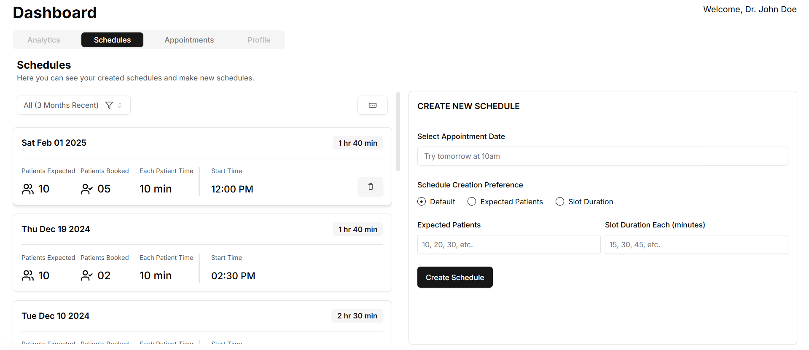
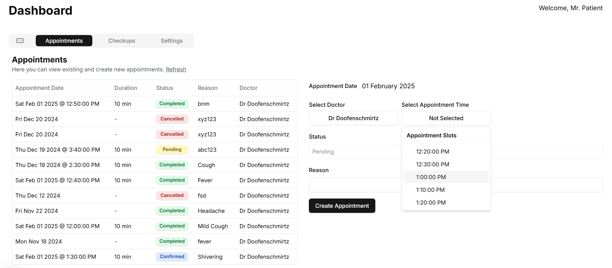
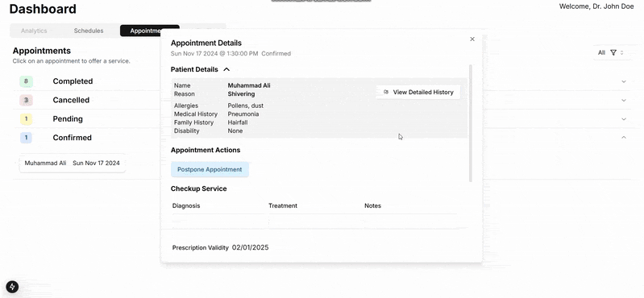

# Hospital Management System

A web app where a hospital's patients, doctors and lab staff work off the same
data. A doctor publishes when they are available, the system turns that into
bookable slots, a patient books one, the doctor runs the checkup and writes a
prescription, and the lab tests that come out of it move through the lab queue.



Next.js App Router and Supabase. There is no separate backend service:
the database is the backend, and the app reaches it through server actions.

## What you can do

- **Sign up once, become someone.** Pick a role (patient, doctor, staff,
  operator), fill in a profile, then fill in what that role needs.
- **Publish availability, not appointments.** "I am in from 2:30pm for two and a
  half hours and I expect ten patients", and the slots appear.
- **Book a real time.** Pick a day, see who is working, see the free slots, take
  one. A taken slot cannot be taken twice.
- **Run the visit.** Diagnosis, treatment, notes, medicines from the drug
  inventory, lab tests to recommend, and an AI summary of the patient's history.
- **Move a lab test through the lab.** Prescribed, requested, accepted by a
  technician, processing. Every step is a guarded transition.

## Stack

| Piece | Used for |
| --- | --- |
| Next.js 15 App Router, React 18, TypeScript | Pages and server actions |
| Supabase (Postgres, Auth, PostgREST) | Data, sessions, email and Google sign in, views |
| `@supabase/ssr` | Cookie based sessions on the server |
| Tailwind, shadcn/ui on Radix | Interface |
| react-hook-form with Zod | Forms, including cross field rules |
| TanStack Table | Data tables |
| chrono-node | Natural language date entry |
| Google Gemini (`gemini-1.5-flash`) | Patient history summaries |

## How it works

### Identity in two parts

A doctor and a patient need very different fields, so the account is split.
`profiles` holds what everyone has (name, gender, role) keyed to the auth user by
`auth_uid`; one table per role (`patients`, `doctors`, `staff`, `operators`)
holds the rest. Signup creates the auth user, profile creation picks the role,
registration fills the role table (`lib/actions/user.actions.ts`).

Role tables can then hold whatever they need, and both routing questions, what
role and finished registering, are one join away.

### Routing lives in the middleware

Four roles plus two step registration means a lot of pages an account should not
be on. Rather than repeat guards per page, `middleware.ts` runs on every non
static request: read the role, check whether the registration row exists, rewrite
the path to the one page that account belongs on. Off prefix requests go home. If
the destination equals the requested path, the request passes through.

Routing is derived from current state instead of remembered, so deep links
resolve rather than error and nobody types their way into another dashboard.

### Server actions instead of an API layer

Every read and write is a `'use server'` function in `lib/actions/`, called
straight from the component. The only route handlers are `/auth/callback` (Google
OAuth exchange) and `/auth/confirm` (email OTP), because external services
redirect into them.

The Supabase client is built per request from the cookie jar
(`utils/supabase/server.ts`), and the user id in a query comes from
`supabase.auth.getUser()` inside the action, never from an argument the browser
sent. No hand written API surface, no duplicated types, and no reading another
account's rows by changing a parameter.

### Schedules become slots in the database

Doctors think in sessions, patients think in appointments. The app writes exactly
one row, into `doctor_schedules` (`from_time`, `to_time`, `expected_patients`).
Slot rows are produced database side; no app code inserts into
`appointment_slots`. They come back nested under the schedule, or through
`view_doctor_schedules`, which includes `booked_slots_count` already computed.

Doctors describe a session three ways, and `ScheduleCreateForm.tsx` reconciles
them before the write:

| Doctor gives | Form derives |
| --- | --- |
| Patients and slot length | End time |
| Patients and end time | Slot length |
| Slot length and end time | Patients |

A cross field Zod `refine` validates the pair the chosen method needs, then the
submit handler derives the third, so the same three columns always reach the
database.

### A slot that is really free

Two patients loading the form at once see the same free slot, and a stored
`is_booked` flag does not help since both read `false` before either wrote.

So availability is derived, not stored. `getAppointmentSlots` asks PostgREST for
slots with appointments embedded, `appointment_slots(..., appointments(id))`, and
keeps the ones where the embedded appointment is null. Underneath,
`appointments.appointment_slot_id` is a one to one foreign key, so Postgres
refuses the second appointment and the loser of a race gets an error rather than
a silent overwrite.



### The life of an appointment

Five states in a Postgres enum: `Pending`, `Confirmed`, `Cancelled`, `Completed`,
`Postponed`. A patient creates a `Pending` appointment against a slot. The
doctor's dashboard groups by state and offers only that state's actions: confirm
and cancel for pending, postpone and the checkup form for confirmed.

Confirming writes status and `appointment_slot_id` together, because the doctor
can keep the patient's slot or move the appointment to another free one. The
picker looks forward from a date rather than at a single day, so pushing an
appointment out a week is the same interaction as confirming it for this
afternoon.

### Submitting a checkup

One button press is six writes across six tables, and later writes need ids the
earlier ones generate, so `submitCheckup` runs them in dependency order and
threads ids forward:

1. `service` row, returns its id
2. appointment marked `Completed`
3. `prescriptions` row, returns its id
4. `medication` rows, pointing at the prescription and a `drugs_inventory` id
5. `checkups` row, tying service, appointment and prescription together
6. `lab_tests` rows, only if any were recommended

Lab tests deliberately get no `service` row here. A service is work the hospital
is doing, and at this point the test is only a recommendation. It starts as
`Prescribed` and the service row waits for a technician, so billing never sees a
service for work nobody agreed to.



### Lab tests move by compare and set

Two roles touch the status at different times, and read, check, then write leaves
a window where somebody else already changed it. Every transition is instead one
update carrying the old state in its `WHERE` clause
(`lib/actions/staff.actions.ts`):

| Action | New status | Guard |
| --- | --- | --- |
| Patient requests | `Requested` | own patient id |
| Technician accepts | `Ready for Sampling` | `status = 'Requested'` |
| Technician starts | `Processing` | `status = 'Ready for Sampling'` and `technician_id` |

Condition and write are the same statement, so a stale request changes nothing. A
test cannot be accepted twice, and a technician cannot start a test that is not
theirs. Status also picks which date the patient sees on the card: request,
approval or completion.

### An AI summary a doctor can use

Nobody reads a long history during a five minute appointment.
`patient_historical_record`, a view, flattens the history into rows;
`getPatientHistoryAISummary` wraps it in a prompt asking Gemini for a fixed JSON
shape (summary, key conditions, recent medications, important lab tests);
`PatientHistoryAISummary.tsx` parses the JSON out of the fenced block and renders
each field as its own card.

The fixed shape is the point. The same four things sit in the same places every
time, so the card can be skimmed, and a thin history shows as an empty card
instead of a paragraph that quietly leaves something out.
`supabase/functions/generate-patient-history-summary` does the same job inside
Supabase and upserts into `patient_summaries`, so a summary can be cached per
patient rather than generated per view.

### Views do the joins

Postgres returns the shapes the dashboards need, already flat:

| View | Returns |
| --- | --- |
| `doctors_appointments_with_patients_inslot` | An appointment with patient name, allergies, history, slot times |
| `patient_appointments_with_doctors_inslot` | The mirror image, with the doctor's name |
| `view_doctor_schedules` | Schedules with booked slot counts |
| `patient_historical_record` | A patient's full history, flattened |

Each carries `auth_uid`, so the action filters by the caller's own id and strips
the column before rows reach the browser. The alternative, a nested PostgREST
select, arrives as objects inside objects that need reshaping in JavaScript.

### Interface details

- **Dates in plain English.** Schedule creation starts with a box reading "Try
  tomorrow at 10am". chrono-node parses every keystroke, the dropdown shows the
  parsed result, and picking one writes a formatted string back plus the real
  `Date` into the form. A regex checks the text still matches that shape, so
  editing it clears the value instead of leaving a date the user cannot see.
- **Filters are computed.** Today, yesterday, tomorrow, upcoming and last 30 days
  are one function, `getDatesForFilter`, turning a keyword into a start and end
  `Date`. Schedules and appointments share one definition of "today".
- **The interface remembers you.** Selected tab, active filter and which fields
  the schedule cards show go to `localStorage`, read back in the `useState`
  initialiser.
- **Medicines are searched.** The picker queries `drugs_inventory` case
  insensitively as the doctor types, six at a time, merged and deduped by id.
  Selecting one adds a row to an editable table of dosage, duration and
  guidelines, and that table is what gets submitted.

## Running it

Node 18 or newer and a Supabase project.

```bash
npm install
npm run dev
```

Runs on http://localhost:3000. Create `.env.local`:

| Variable | Used for |
| --- | --- |
| `NEXT_PUBLIC_SUPABASE_URL` | Supabase project URL |
| `NEXT_PUBLIC_SUPABASE_ANON_KEY` | Supabase anonymous key |
| `GEMINI_API` | Google Gemini key, for the history summary |

Two things matter when hosting elsewhere:

- The Google sign in redirect is `http://localhost:3000/auth/callback` in
  `lib/actions/user.actions.ts` and must match the redirect URL set in Supabase
  Auth.
- The schema lives in the Supabase project, not this repo. `types/supabase.ts`,
  generated from it, is the reference for tables, views and enums.

The Edge Function deploys separately with the Supabase CLI and reads its own
`DATABASE_URL` and `SUPABASE_ACCESS_TOKEN` from the function environment.

## Project layout

| Path | What is in it |
| --- | --- |
| `app/` | Routes: one folder per role with its dashboard and registration page, plus landing, login and the two auth handlers |
| `middleware.ts` | Role and registration based routing |
| `lib/actions/` | Server actions, split by role |
| `components/forms/` | Zod and react-hook-form forms: registration, schedules, booking, checkups |
| `components/custom/` | Domain components: tables, lab test cards, prescription dialog, medicine picker, `linguatime/` date picker |
| `components/ui/` | shadcn/ui primitives |
| `utils/supabase/` | Request scoped Supabase clients |
| `supabase/functions/` | Deno Edge Function for history summaries |
| `types/supabase.ts` | Types generated from the schema |
